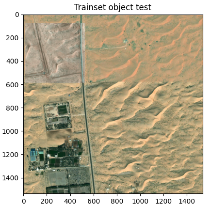
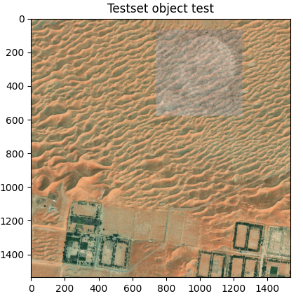
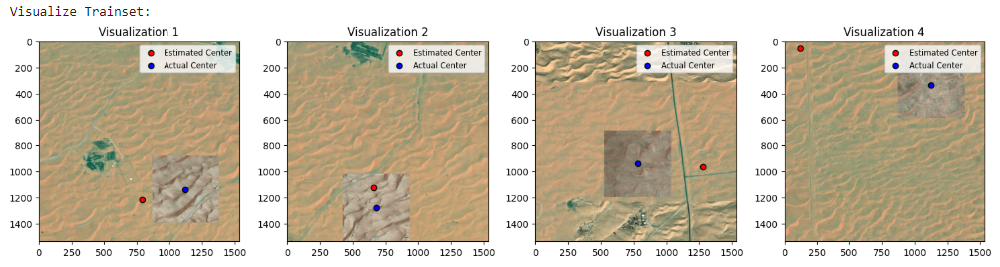
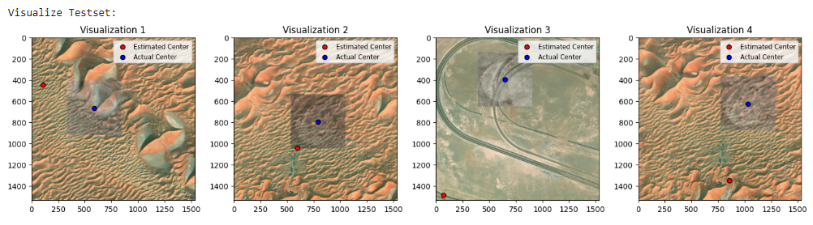
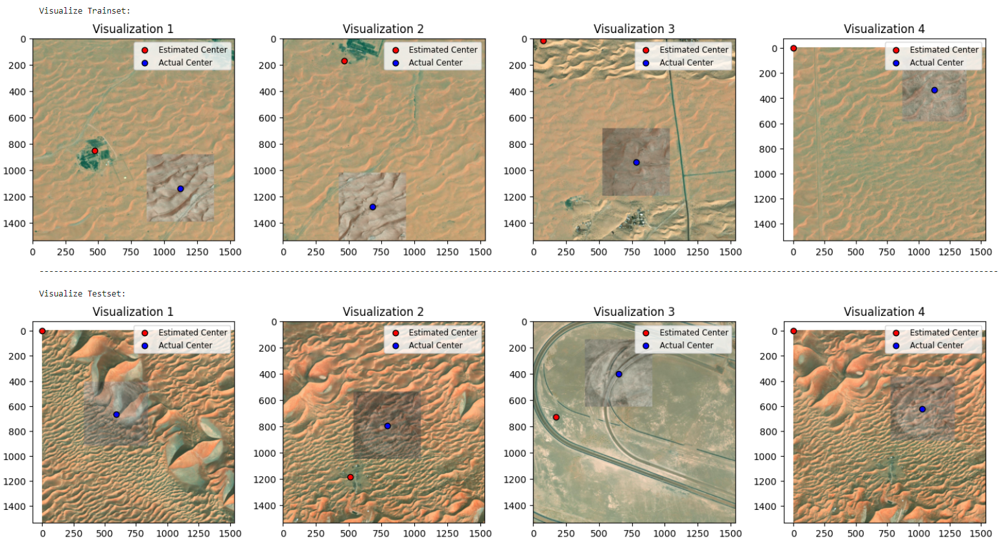
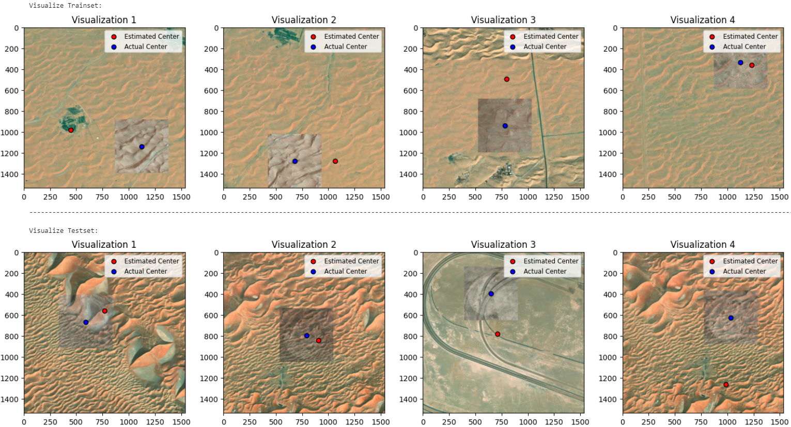
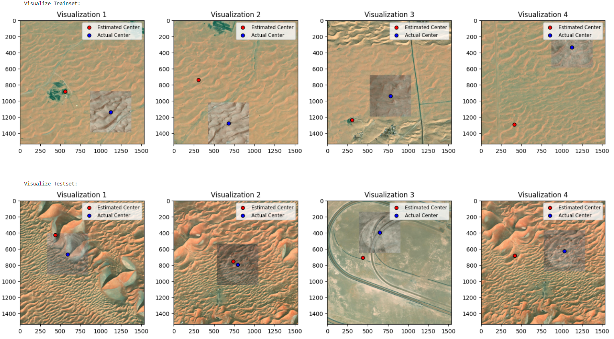
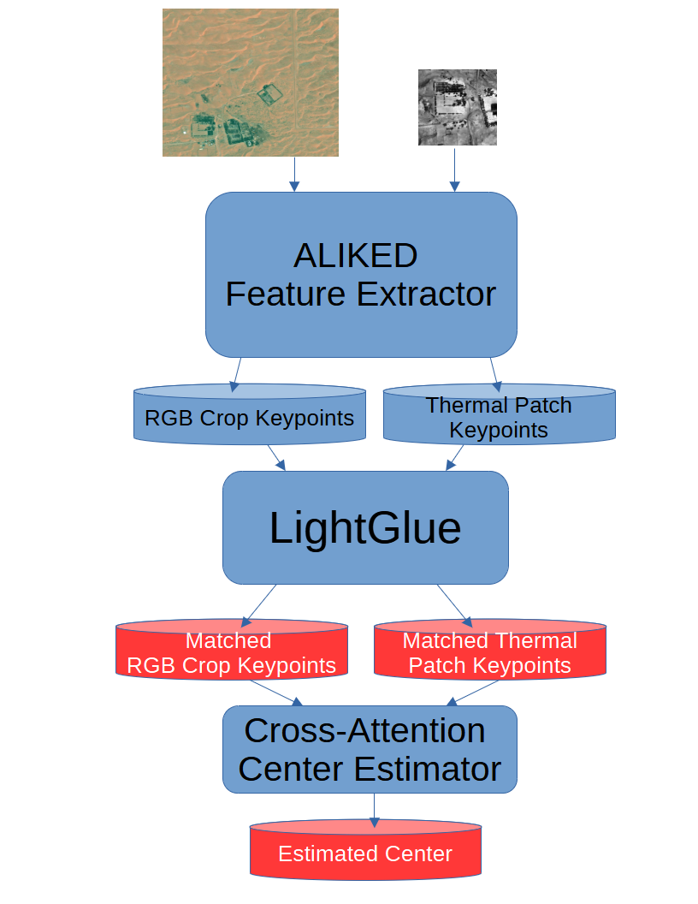
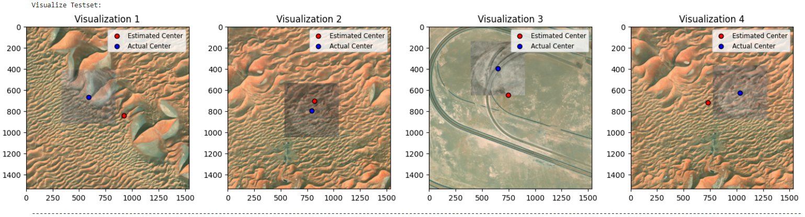

# TII Assingment 

This repo is created as a part of Patch Matching Assignment for TII Autonomous Robotics Research Center.

Assignment Summary:
> Given an orthorectified RGB map and a pickle file containing thermal patches, the task is to develop a solution for matching thermal patches on the RGB base map. The Euclidean distance between the predicted center and the ground-truth center should be used as the error metric. The center of the thermal patch can be seen as the ground-truth center on the base map.

Read LICENSE.md [here](./LICENSE.md) 

# Reproducing the results
The code is written and tested in Windows 11 Pro OS. 

Python version: 3.12.7

Pip version: 24.3.1

Pytorch Version : 2.5.1+cu121


Create a virtual environment and activate it.
Then follow the below commands in order.

```
git clone https://github.com/ubeydemavus/tii-assignment.git
cd tii-assignment
pip3 install torch torchvision torchaudio --index-url https://download.pytorch.org/whl/cu121 
git clone https://github.com/cvg/LightGlue.git && cd LightGlue
python -m pip install -e . & cd ..
pip install joblib
pip install jupyterlab
pip install tqdm
mkdir datasets
```

Copy the "rgb_zone1.png", "rgb_zone2.png", "thermal_zone1.png" and "uav.pkl" files into `datasets/` folder. (They are not pushed to the repo. Make sure to use correct version of "rgb_zone1.png" and "thermal_zone1.png" files.) 

using `jupyter lab` command, you can start jupyter server.


# Approach
The assignment involves generating datasets using multiple RGB base maps, a thermal base map and pre-cropped thermal patches. A 1536x1536 px random crop from an RGB base map is matched with a 512x512 px random thermal patch from the same area via the thermal base map. This combined pair is used as the training set for the final neural network architecture.

Additionally, an RGB base map with pre-cropped thermal patches is provided. A separate training set is created from this map as well.

Once the datasets are prepared, a baseline is established to evaluate the performance of center prediction methods. This baseline serves as a reference to compare the performance of intermediate models and the final trained center-estimation model.

Afterwards, a cross-attention transformer model is trained to predict the center by using keypoints from the RGB crop and the thermal patch pair. The trained model is tested five times using the test set, with the test set being recreated each time using different random RGB crops via different random generator seeds.

Finally results are reported for the baseline, the intermediate models, as well as the final center prediction pipeline as the average euclidian distance between the centers in pixels. 

# Datasets
The datasets are created on demand lazily via random number generation. This allows to use the same dataset class multiple times with different seeds without changing anything else while keeping the RAM and DISK usage small. The generated datasets only depend on the random number seed, number of samples to generate as well as the base maps. If the inputs to the dataset object is the same, the generated dataset will be the same every time.

The code for the dataset classes reside in "[datasets.py](./datasets.py)" file.

***Example overlay from trainset:***




***Example overlay from testset:***




# Baseline 
The baseline is established by generating random centers as predictions. This approach provides a reference point for the error metric, illustrating how much better any method performs compared to pure chance.

The code for the baseline reside in "[baseline.ipynb](./baseline.ipynb)" file.

### Baseline Results 
> Average trainset error: 683.57 pixels



> Average testset error : 689.38 pixels



# Intermediate Models
There are many state-of-the-art models for keypoint matching, and their performance needs to be evaluated against our datasets. This will help to identify areas for improvement and provide a comprehensive overview of the literature related to the specific problem we are addressing (RGB and Thermal image matching).

The assignment specifies a preference for transformer-based models, such as LightGlue (2023) or LoFTR (2021). Due to time constraints, I chose to use LightGlue, as it offers the latest research results in keypoint matching.

LightGlue is a deep neural network that matches sparse local features across image pairs. This make LightGlue a good starting point for RGB and Thermal image matching problem. 

## Intermediate Model (Vanilla LightGlue) Results 
I tested LightGlue with different local feature extractors as it is partially independent of feature extracter. As long as LightGlue model is trained with a feature extractor, it can use the extractor for matching. 

Since LightGlue only outputs matching keypoints from a pair of images, its predictions are not fully compatible with the center prediction task. However, when enough matching keypoints are found between two images, the average of these keypoints can be used as a center estimate. This is how I measured the performance of the "vanilla" LightGlue model for center prediction.

If LightGlue failed to find matches between the image pair, I assigned a default value of (-1, -1) as the center point estimate to penalize the algorithm. I then measured performance both by including these failed attempts and by excluding them, considering only the successful predictions.

The official repo provides several trained LightGlue models with different feature extractors. I tested three that worked out-of-box.  

The code for the intermediate model results reside in "[vanilla_lightglue.ipynb](./vanilla_lightglue.ipynb)" file

### SuperPoint + LightGlue Results
A short description of SuperPoint from the paper:
> SuperPoint is a self-supervised framework for training interest point detectors and descriptors for multiple-view geometry problems in computer vision. Unlike patch-based models, SuperPoint uses a fully-convolutional network that processes full-sized images to compute pixel-level interest point locations and descriptors in a single pass. The model introduces Homographic Adaptation, a multi-scale, multi-homography approach that enhances interest point detection repeatability and enables cross-domain adaptation (e.g., synthetic to real). Trained on the MS-COCO dataset, SuperPoint outperforms traditional detectors like SIFT and ORB, achieving state-of-the-art homography estimation results on the HPatches benchmark.

Experiments performed five times, each time 5000 samples are used.

    Extractor: SuperPoint
    Metrics Across All Experiments Across All Patches:
        
        Average trainset error (all predictions): 703.96 pixels
        Average testset error  (all predictions): 777.55 pixels
    
        Trainset center point estimation fail count: 10530 out of 25000 estimations
        Testset center point estimation fail count: 12278 out of 25000 estimations
    
        Average trainset error (successful predictions): 398.68 pixels (14470/25000)
        Average testset error  (successful predictions): 436.49 pixels (12722/25000)




*Note: Visualizations 4 and Testset Visualization 1 show examples where the prediction fails. The estimated centers are at (-1, -1), which is outside the RGB crop, causing white bands to appear.* 

### DISK + LightGlue Results
A short description of DISK from the paper:
> DISK (DIScrete Keypoints) is a novel method for local feature matching that addresses the challenges of learning in an end-to-end fashion by using Reinforcement Learning (RL) principles. It optimizes for a high number of correct feature matches while maintaining a simple, probabilistic model that ensures good convergence for reliable training. DISK allows for dense yet discriminative feature extraction, challenging traditional assumptions about keypoint quality, and achieves state-of-the-art performance on three public benchmarks.

Experiments performed five times, each time 5000 samples are used.

    Extractor: DISK
    Metrics Across All Experiments Across All Patches:
        
        Average trainset error (all predictions): 535.87 pixels
        Average testset error  (all predictions): 638.25 pixels
    
        Trainset center point estimation fail count: 3703 out of 25000 estimations
        Testset center point estimation fail count: 6110 out of 25000 estimations
    
        Average trainset error (successful predictions): 434.39 pixels (21297/25000)
        Average testset error  (successful predictions): 482.44 pixels (18890/25000)



### ALIKED + LightGlue Results
A short description of ALIKED from the paper:
> ALIKED introduces the Sparse Deformable Descriptor Head (SDDH), a method that enhances keypoint and descriptor extraction by learning deformable positions of supporting features for each keypoint. Unlike traditional dense descriptor maps, SDDH extracts sparse yet highly expressive descriptors, improving efficiency. The method also modifies the neural reprojection error (NRE) loss to work with sparse descriptors, enabling better performance in tasks like image matching, 3D reconstruction, and visual relocalization. Experimental results demonstrate its efficiency and effectiveness across various visual measurement tasks.

Experiments performed five times, each time 5000 samples are used.

    Extractor: ALIKED
    Metrics Across All Experiments Across All Patches:
        
        Average trainset error (all predictions): 353.78 pixels
        Average testset error  (all predictions): 504.85 pixels
    
        Trainset center point estimation fail count: 660 out of 25000 estimations
        Testset center point estimation fail count: 746 out of 25000 estimations
    
        Average trainset error (successful predictions): 330.81 pixels (24340/25000)
        Average testset error  (successful predictions): 485.20 pixels (24254/25000)



# Cross-Attention Center Estimator
The best performing model turned out to be ALIKED + LightGlue with the least failed predictions. Therefore I chose it as a basis for the Cross Attention Center Estimator. This model takes the matched keypoints with the highest matching score and performs cross attention between the keypoints of RGB and Thermal images. Finally a regression head used to generate the final center prediction.

### Overall pipeline 
The overall pipeline starts with a pair of RGB crop and a Thermal patch. ALIKED feature extractor outputs keypoints with their respective descriptors. LightGlue takes the keypoints and feature descriptors and matches them together and outputs matching scores as well as matched keypoints. Finally center estimating cross-attention tranformer takes these matched points and predicts center by attending keypoints from RBG Crop to Thermal Patch 



### Cross-Attention Center Estimator: Detailed Breakdown

The model comprises three distinct stages:

1. **Keypoint Encoder**  
   Projects keypoints into a higher-dimensional space to create feature-rich representations.

2. **Stacked Cross-Attention Transformer**  
   - Uses attention mechanisms to "relate" matched high-dimensional keypoint representations between the RGB crop and the thermal patch.  
   - **Query:** Keypoints from the matched RGB crop (the points we aim to align with the thermal patch).  
   - **Key & Value:** Keypoints from the thermal patch (providing information for matching and alignment).  
   - The transformer computes attention weights by evaluating the similarity between the RGB crop's query and the thermal patch's key. These weights are used to aggregate the corresponding values, forming the "attended" representation.

3. **Regression Head**  
   Averages the attended high-dimensional representations and performs regression to predict the center coordinates.

This mechanism effectively aligns RGB and thermal data by leveraging the transformer's attention to identify correspondences between the two images.

## Training
The Cross-Attention Center Estimator is trained with 5000 image pairs from trainset for 200 epochs with a batch number of 32, a learning rate of 0.001, using adam optimizer and a learning rate scheduler. The transformer has two layers with four attention heads in each layer. The keypoint embeddings have 128 dimensions. The regression head have 2 fully connected layers. The model has been trained with a Nvidia RTX 4090 24 GB gpu. 

The code for the model reside in "[CrossAttentionCenterEstimator.py](./CrossAttentionCenterEstimator.py)"

The code for training the model as well as testing reside in "[aliked+lightglue+centerEstimator.ipynb](./aliked+lightglue+centerEstimator.ipynb)"

## Evaluation
Testing is performed 5 times with 5000 sample image pairs from testset. The results for each experiment as well as the results across experiments can be found in "[aliked+lightglue+centerEstimator.ipynb](./aliked+lightglue+centerEstimator.ipynb)"

For each individual experiment results please refer to the .ipynb file.

Results across experiments for the trained model: 

    Metrics for All experiements Across All Patches:
        
        Average testset error  (all predictions): 373.12 pixels
        
        Testset center point estimation fail count: 1492 out of 25000 estimations
        
        Average testset error  (successful predictions): 349.42 pixels (23508/25000)




# Conclusion
In this assignment, datasets from base maps are created. A cross-attention transformer based center estimator model is designed, trained and tested with the said datasets. Performances measured and reported for baseline, vanilla LightGlue and Cross-Attention Center Estimator models. Improvements are measured in percentage improvement:

$$
\text{Percentage Improvement} = \frac{\text{Avg. Baseline Distance Error} - \text{Avg. Model Distance Error}}{\text{Avg. Baseline Distance Error}} \times 100
$$

### Performance Improvement Summary Over Baseline (Pure Chance):
| **Method**                                                | **All predictions Testset**| **Successful Predictions Testset** |
|-----------------------------------------------------------|--------------------|----------------------------|
| **Vanilla LightGlue (ALIKED + LightGlue)**                | **26.7%**          | **29.6%**                  |
| **ALIKED + LightGlue + Cross-Attention Center Estimator** | **45.9%**          | **49.3%**                  |


### Performance Improvement Summary Over Vanilla LightGlue (ALIKED + LightGlue):
| **Method**                                                | **All predictions Testset**| **Successful Predictions Testset** |
|-----------------------------------------------------------|--------------------|----------------------------|
| **ALIKED + LightGlue + Cross-Attention Center Estimator** | **26.1%**          | **28.0%**                  |


**Cross-Attention Center estimator** improves performance over **vanilla LightGlue method** around **27%** for the center prediction task.

# Future Work

While the Cross-Attention Center Estimator outperforms vanilla LightGlue in the center prediction task, there is significant room for improvement in center prediction accuracy (reducing the error metric). Potential improvements include:

- **Data Augmentation:** Using image transformations, particularly homography transformations, during training to enhance the model's robustness.  
- **Fine-Tuning LightGlue:** Adapting LightGlue with the training dataset to output more accurate matching keypoints.  
- **Modifying LightGlue Architecture:** Training LightGlue to predict centers directly rather than just providing matching keypoints between image pairs.  
- **Hyperparameter and Architecture Tuning:** Performing exhaustive experiments on the Cross-Attention Center Estimator to refine its performance (limited time prevented this during the assignment).  
- **Eliminating LightGlue:** Training the Cross-Attention Center Estimator directly using keypoints from a feature extractor to predict centers, removing the need for LightGlue altogether and reducing computational costs.  
